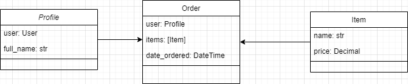

# Desafio Django - API RESTful de Gerenciamento de Usuários, Pedidos e Itens

Este é um projeto Django Rest Framework que implementa uma API RESTful para gerenciar usuários, pedidos e itens. A API oferece as seguintes funcionalidades:

## Gerenciamento de Usuários

- Criar um novo usuário com um nome de usuário e senha exclusivos.
- Autenticar um usuário usando seu nome de usuário e senha.
- Atualizar as informações do perfil de um usuário (por exemplo, nome, e-mail, etc.).
- Recuperar as informações do perfil de um usuário.

## Gerenciamento de Itens

- Criar um novo item com nome e preço.
- Atualizar o nome e o preço de um item.
- Excluir um item.
- Recuperar uma lista de todos os itens.

## Gestão de Pedidos

- Criar um novo pedido para um usuário, contendo um ou vários itens.
- Recuperar todos os pedidos de um usuário.
- Recuperar detalhes de um pedido específico, incluindo os itens.

## 🚀 Pré-requisitos

- Python 3.10
- Django==4.2.5
- django-filter==23.3
- djangorestframework==3.14.0
- drf-spectacular==0.26.5

## 📋 Modelagem do projeto



## 💻 Configuração do Ambiente

1. Clone este repositório:
   ```bash
   git clone https://github.com/H1d3l/desafio-medclub.git
   cd desafio-medclub
   ```
2. Crie um ambiente virtual (opcional, mas recomendado):
   ```bash
   python -m venv venv
   source venv/bin/activate  # No Windows, use "venv\Scripts\activate"
   ```
3. Instale as dependências do projeto:
   ```bash
   pip install -r requirements.txt
   ```
4. Aplique as migrações do banco de dados:
   ```bash
   cd apimedclub
   python manage.py migrate
   python manage.py makemigrations
   python manage.py migrate
   ```
5. Crie um superuser para acessar a API:
   ```bash
   python manage.py createsuperuser
   ```
6. Inicie o servidor de desenvolvimento:
   ```bash
   python manage.py runserver
   ```
7. Acesse o projeto em http://localhost:8000/

## Endpoints

A documentação dos endpoints do projeto está disponível através do Swagger.
Para realizar as requisições será necessário informar o username e password do superuser criado anteriormente.
- Para acessar a documentação, vá para http://127.0.0.1:8000/api/schema/swagger-ui/#/ .
- Você também pode usar a interface ReDoc acessando http://127.0.0.1:8000/api/schema/redoc/ para uma visualização mais amigável da documentação.

### Endpoints disponíveis

| uri 										| Funcionalidade |
|:---:										|:----------------|
| user/ 				| Listagem e cadastro de usuários |
| user/{id}/ 				| Acesso aos dados de um usuários específico  |
|	user/{id}/										| Atualização e exclusão de dados de acordo com o ID passado |
| profile/ 			| Listagem do perfil de todos os usuários |
| profile/{id}/ 			| Atualização e exclusão de dados de acordo com o ID passado |
| profile/{id}/get_profile_by_user_id/ 			| Obtém as informações do perfil de um usuário |
| order/ 			| Listagem e cadastro de pedidos|
| order/{id}/										| Atualização e exclusão de dados de acordo com o ID passado |
| order/{id}/										| Acesso aos dados de um pedido específico
| order/{id}/get_order_by_profile_id/ 				| Obtém as informações do pedido de um usuário |
| item/			| Listagem e cadastro de item |
| item/{id}/											| Acesso aos dados de um item específico |
| item/{id}/											| Atualização e exclusão de dados de acordo com o ID passado |
|

### Formatos das requisições
```json
User{
    "profile": {
      "full_name": "string"
    },
    "username": "string",
    "email": "string",
    "password": "string"
}

Profile   {
    "full_name": "string"
}

Item   {
  "name": "string",
  "price": "decimal"
}

Order   {
    "user": "id",
    "items": [
      "id"
    ]
  }
```
